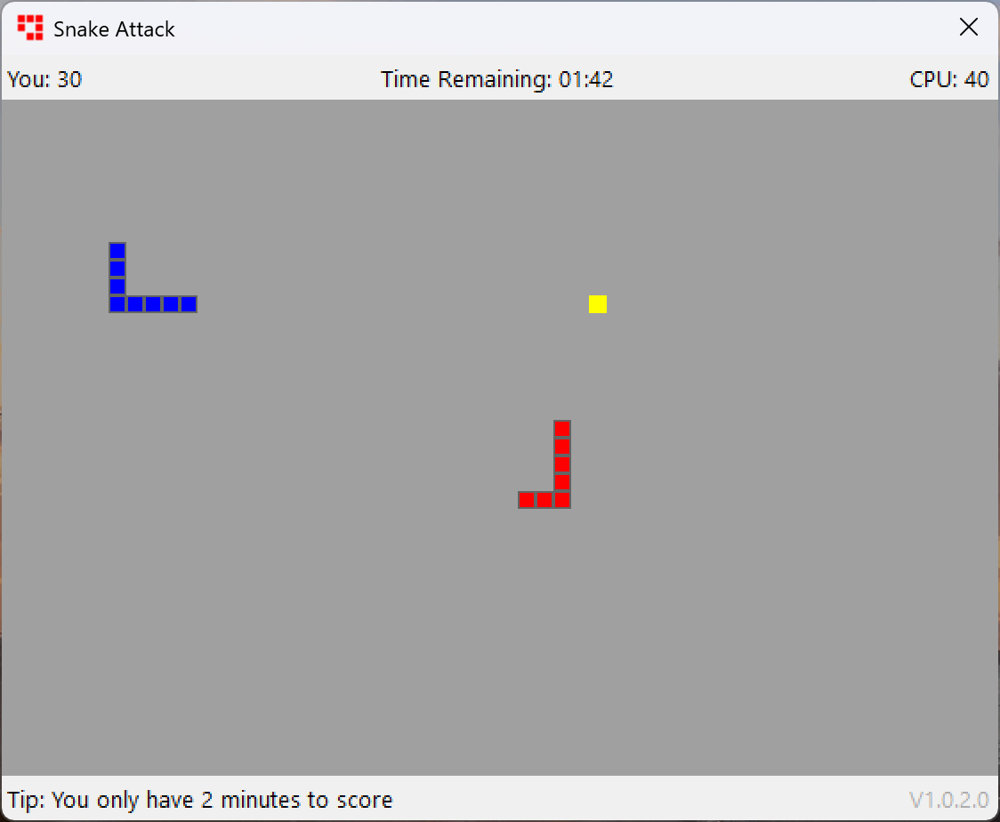
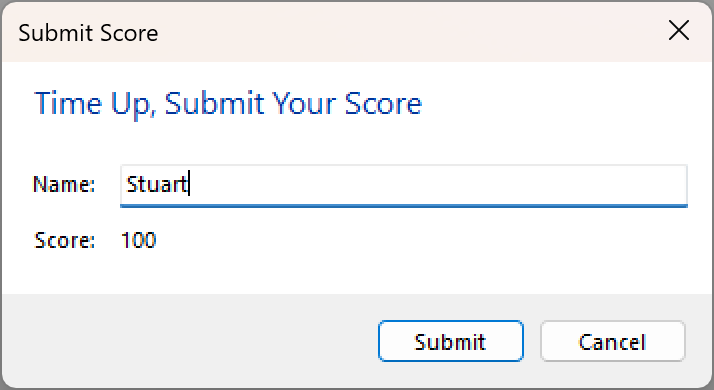
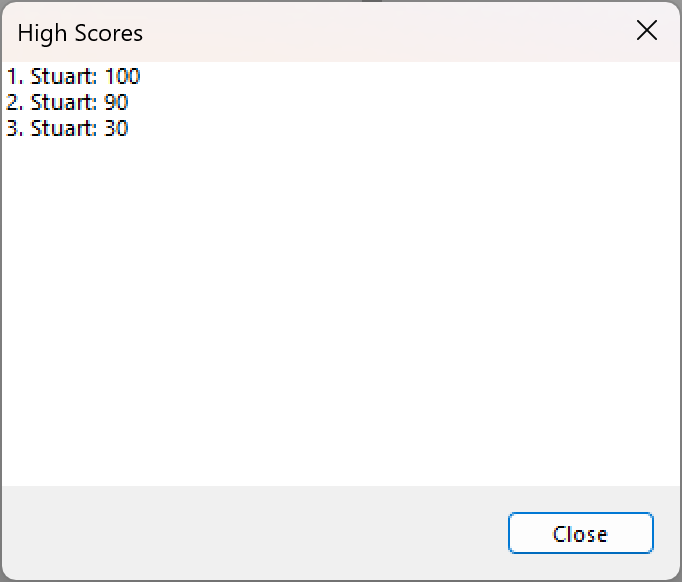
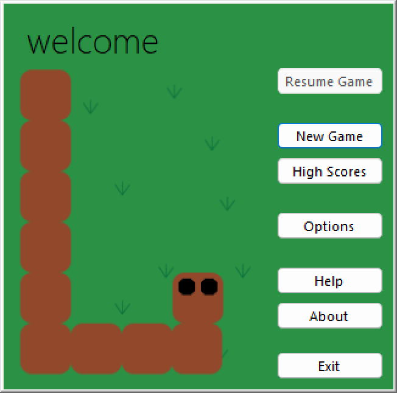
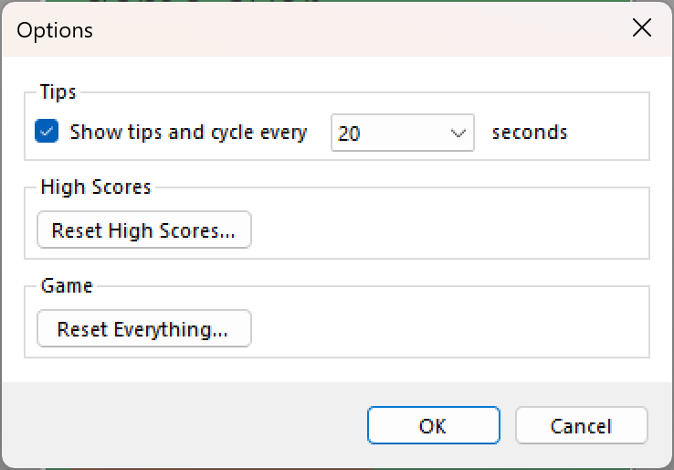
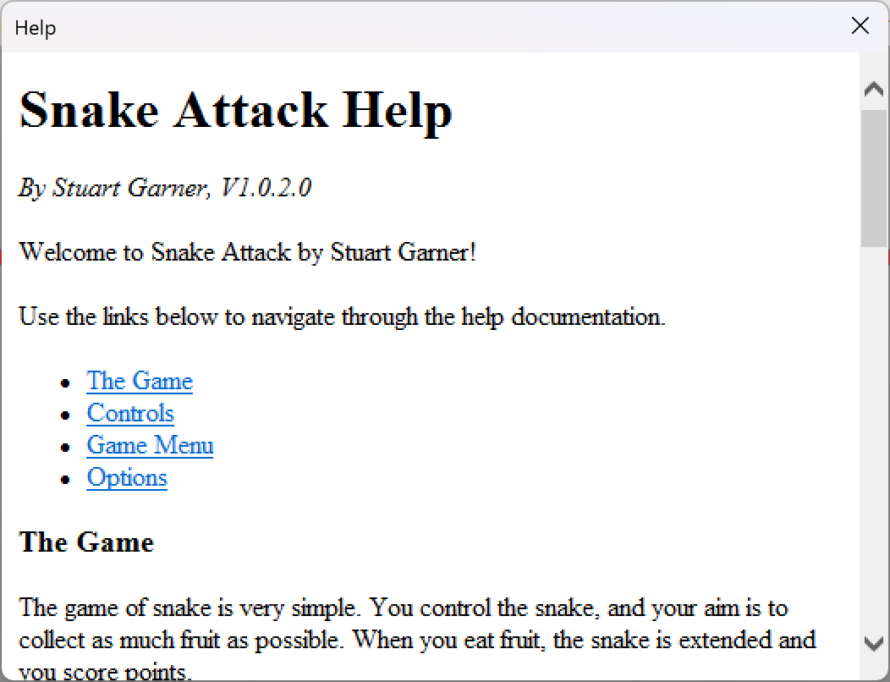

# Visual Basic Snake
A classic Visual Basic Snake game. This was one of my Year 11 computing class assignments and is untouched since 2012.

Although the source files haven't been modified since 2012, the solution has been upgraded from .NET 4.0 to .NET 4.8.

## Gameplay

